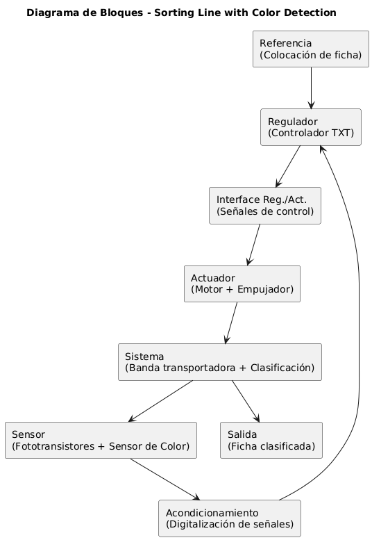

# Proyecto 2 corte
# Sorting Line Color Machine
## Valentina Ruiz, Tomas Barrios, Darek Aljuri, Rafael Salcedo
## 1. Resumen General
El proyecto busca desarrollar un prototipo funcional de línea de clasificación de piezas por color, utilizando el kit Sorting Line with Color Detection 9V de Fischertechnik, con el fin de representar de forma práctica un proceso de control industrial real e integrar los principios de percepción (sensores), actuación (actuadores), computación (controlador) y conectividad, propios del IIoT.

En la vida real, este tipo de sistema es aplicable en múltiples sectores como la industria alimentaria con la clasificación de frutas, vegetales o granos según color, maduración o defectos, la industria farmacéutica para la separación de pastillas o cápsulas defectuosas, líneas de ensamblaje para control de calidad y separación de componentes en función de su acabado o características visuales.

Además, el proyecto busca desarrollar un gemelo digital de la máquina de clasificación por color, implementado en CODESYS. A través de la programación en Ladder, se diseñará una visualización funcional virtual del prototipo, permitiendo digitalizar el sistema, simular su comportamiento y facilitar tanto la validación como la optimización del proceso antes de su implementación física

### Descripción del proceso 

La línea de clasificación consiste en [1]:

- Alimentación de piezas: Las piezas, geométricamente idénticas pero de diferentes colores, ingresan al sistema mediante una cinta transportadora impulsada por un motor
  
- Percepción: Un sensor óptico de color detecta la tonalidad de cada pieza a partir de la reflexión de su superficie. Durante el paso de la pieza por debajo del sensor, se determina el valor mínimo medido y este se compara con valores límite para asignar la pieza a los colores blanco, rojo o azul.

- Computación y control: El controlador procesa la señal del sensor, compara el valor mínimo con los umbrales configurados y clasifica cada pieza según su color. El instante de expulsión se define a partir de la detección previa de la pieza por una barrera de luz y la posición medida por el interruptor de pulsos.

- Actuación: Dependiendo del color detectado, las válvulas solenoides activan cilindros neumáticos que desvían las piezas hacia la rampa o contenedor asignado.

- Salida: Las piezas expulsadas se dirigen a través de tres rampas hacia los compartimientos correspondientes. Barreras de luz supervisan el flujo de piezas y el estado de llenado de cada compartimiento.

## 2. Etapas de diseño

### Análisis del proceso
El sistema corresponde a una máquina clasificadora de objetos por color (sorting color machine). El flujo general del proceso es el siguiente:
- Alimentación y transporte:
  - Un motor acciona la banda transportadora.
  - En la zona inicial se ubica un sensor infrarrojo de presencia, que detecta si hay un objeto colocado sobre la banda.
    - Si no se detecta objeto, la banda permanece detenida.
    - Si se detecta objeto, la banda se activa y comienza el transporte.

- Detección de color:
  - Mientras el objeto avanza, ingresa a una cámara de detección (caja roja).
  - Allí, un sensor de color identifica el color del objeto.

- Salida de la cámara y temporización:

  - Al abandonar la caja roja, un segundo sensor infrarrojo confirma la salida del objeto.
  - En este punto, el sistema activa un contador/temporizador asociado al color detectado.
  - Este contador genera un retardo  que asegura que el objeto se encuentre correctamente alineado con el mecanismo de clasificación antes de actuar.

- Clasificación por color:

  - Una vez transcurrido el tiempo definido por el contador, se habilita la válvula solenoide correspondiente al color detectado.

  - Las válvulas son normalmente cerradas (NC) [2]: Con señal eléctrica, se abren y permiten el paso de aire comprimido, el aire acciona un cilindro neumático (pistón), que empuja la pieza hacia el compartimiento asignado según su color, cuando la válvula deja de recibir señal, se cierra y el pistón retorna a su posición inicial por medio de un resorte.

- Verificación de clasificación:
  - En cada compartimiento de descarga hay un sensor infrarrojo final, encargado de verificar si la pieza llegó correctamente.
  - Si la pieza fue clasificada, el sistema detiene la banda transportadora y reinicia el ciclo para el siguiente objeto.

  

### Restricciones de diseño

Las siguientes restricciones de diseño del prototipo se establecieron siguiendo la ISO/IEC/IEEE 29148:2018, estándar que define buenas prácticas para la especificación de requisitos de sistemas y software. Bajo esta guía, se formularon los requerimientos funcionales y no funcionales considerando aspectos técnicos, asi como de escalabilidad y conectividad, con el fin de asegurar un diseño claro, trazable y evaluable.

| Código | Tipo        | Nombre del Requerimiento | Descripción                                                                 | Prioridad | Viabilidad técnica                                                                 | Restricciones                                      | Recursos requeridos                        | Impacto                                               |
|--------|-------------|--------------------------|-----------------------------------------------------------------------------|-----------|--------------------------------------------------------------------------------------------------------|---------------------------------------------------|--------------------------------------------|-------------------------------------------------------|
| RF-01  | Funcional   | Detección de color       | El sistema debe identificar piezas de al menos 3 colores distintos mediante el sensor óptico. | Alta      | El kit Fischertechnik incluye un sensor de color analógico calibrable para distinguir múltiples tonos. | Limitado al espectro soportado por el sensor       | Sensor óptico de color                     | Permite clasificación automática.                     |
| RF-02  | Funcional   | Clasificación automática | El sistema debe desviar cada pieza hacia el contenedor correspondiente según su color. | Alta      | El kit dispone de compresor, válvulas y actuadores neumáticos que permiten desviar las piezas con precisión. Así como fototransistores para garantizar la presencia de los objetos y la sincronización del sistema. | Número de salidas limitado a 3 contenedores      | Motores, válvulas, compresor y fototransistores              | Representa el proceso industrial de sorting.          |
| RF-03  | Funcional   | Registro de datos        | El sistema debe enviar el resultado de clasificación (color detectado y cantidad de piezas) a un servidor IoT. | Media     | El controlador TXT/PLC puede comunicarse vía Ethernet/WiFi con un servidor externo, aunque requiere configuración adicional.  | Depende de conectividad disponible                 | Controlador con WiFi/Ethernet, servidor IoT| Integra IIoT y análisis remoto.                       |
| RF-04  | Funcional   | Interfaz de monitoreo    | El usuario debe visualizar en tiempo real la operación (colores detectados, conteo, estado de actuadores). | Media     |  Existen plataformas como Node-RED o Grafana que pueden integrarse con el controlador para mostrar datos en dashboards simples. Inicialmente, se muestran datos básicos en el display del controlador.| Requiere desarrollo de software adicional          | Node-RED, Grafana o app web                | Mejora la usabilidad y monitoreo remoto.              |
| RNF-01 | No funcional| Limitación de energía    | El prototipo debe funcionar con fuentes de 9v y los sensores adicionales deberian funcionar con 9 o 5 v   | Media      |  Los voltajes deben estar soportados oficialmente por Fischertechnik, y se dispone de fuentes de laboratorio. | Depende de disponibilidad de fuente y controlador  | Fuente de poder, adaptadores               | Asegura compatibilidad con componentes Fischertechnik. |
| RNF-02 | No Funcional | Mantenibilidad | El sistema debe estar diseñado de forma modular para facilitar el reemplazo de sensores, actuadores o controladores sin necesidad de rediseñar todo el prototipo. | Baja |  Los kits de Fischertechnik son modulares y permiten intercambiar componentes fácilmente. | Limitado a la compatibilidad de módulos disponibles en el kit. | Herramientas básicas, repuestos del kit. | Impacta en la sostenibilidad y reutilización del prototipo a largo plazo. |
| RNF-03 | No funcional| Escalabilidad            | El sistema debe permitir la ampliación hacia más colores o integración con otros módulos. | Baja     |  El controlador dispone de entradas/salidas adicionales que permiten integrar más sensores o módulos industriales. | Limitado por número de sensores/entradas del controlador | PLC o controlador con entradas libres     | Facilita futuras expansiones del proyecto.            |

#### Criterios y estandares de diseño establecidos
El diseño del prototipo de Sorting Line with Color Detection se fundamenta en los lineamientos de la norma ISO/IEC/IEEE 29148:2018 que se refiere a Systems and Software Engineering, Life Cycle Processes, Requirements Engineering [3], la cual establece directrices para la definición de requerimientos funcionales y no funcionales en proyectos de ingeniería. Adicionalmente, se adoptaron estándares aplicables en la industria de automatización y control, asegurando que el sistema sea seguro, escalable, reproducible y mantenible.

##### Principios generales de diseño (IEEE 29148:2018)

- Claridad y no ambigüedad: cada requerimiento debe estar expresado de forma precisa, sin interpretaciones múltiples.

- Corrección: los requerimientos deben reflejar exactamente las necesidades del proceso de clasificación automatizado.

- Consistencia: los requerimientos no deben entrar en conflicto entre sí.

- Rastreo (Traceability): los requerimientos se deben poder vinculae con un objetivo, módulo de diseño, implementación y prueba.

- Viabilidad técnica: los requerimientos deben ser alcanzables con los recursos de hardware/software disponibles.

- Verificabilidad: todo requerimiento debe poder validarse mediante pruebas medibles y repetibles.

- Priorización: los requerimientos deben clasificarse en críticos, deseables y opcionales según el impacto en la operación.

#### Estandar IEC 61131-3
- Estándar internacional para lenguajes de programación de  Controladores Lógicos Programables (PLC) industriales, proporcionando un conjunto de lenguajes y estructuras comunes para la automatización, asegurando la independencia del fabricante y permitiendo la portabilidad y reutilización de código (incluye Ladder). [4]

##### Criterios específicos del proyecto

- El sistema debe clasificar piezas de acuerdo con colores rojo, azul y verde, con un nivel de precisión ≥ 95 %.

- El tiempo de respuesta entre la detección y la actuación debe ser ≤ 200 ms.

- El prototipo debe permitir escalabilidad para incluir nuevos sensores/actuadores.

- El código y los esquemáticos deben estar completamente documentados para garantizar mantenibilidad.

### Variables Generales del Sistema
| Name      | Attrib  | Type  | Comment                                                                |
|-----------|---------|-------|------------------------------------------------------------------------|
| Input0_0  | [Input] | BOOL  | Sensor F1 — Detecta llegada pieza (activa banda M1 y motor válvula M2) |
| Input0_1  | [Input] | BOOL  | Detector de color C1 — Blanco                                          |
| Input0_2  | [Input] | BOOL  | Detector de color C2 — Rojo                                            |
| Input0_3  | [Input] | BOOL  | Detector de color C3 — Azul                                            |
| Input0_4  | [Input] | BOOL  | Sensor F2 — Zona temporizado (dispara el timer seleccionado por color) |
| Input0_5  | [Input] | BOOL  | Sensor F3 — Llegada a salida/estación 1 (posición V1)                  |
| Input0_6  | [Input] | BOOL  | Sensor F4 — Llegada a salida/estación 2 (posición V2)                  |
| Input0_7  | [Input] | BOOL  | Sensor F5 — Llegada a salida/estación 3 (posición V3)                  |
| Input0_8  | [Input] | BOOL  | START — Pulsador de inicio (habilita ciclo)                            |
| Input0_9  | [Input] | BOOL  | STOP — Pulsador de paro (paro de emergencia / detención)               |
| Output0_0 | [Output]| BOOL  | Motor M1 — Banda transportadora (arranque/parada)                      |
| Output0_1 | [Output]| BOOL  | Motor M2 — Motor de la válvula (o alimentador de válvulas)             |
| Output0_2 | [Output]| BOOL  | V1 — Solenoide / válvula para piezas blancas                           |
| Output0_3 | [Output]| BOOL  | V2 — Solenoide / válvula para piezas rojas                             |
| Output0_4 | [Output]| BOOL  | V3 — Solenoide / válvula para piezas azules                            |

### Diagrama de función secuencial

A partir de las variables generales definidas anteriormente, el sistema se diseñó bajo un enfoque de control secuencial por etapas (Step Sequence Control). Cada etapa (S) representa un estado del proceso, mientras que las transiciones se activan cuando se cumplen condiciones de sensores (entradas).

El siguiente diagrama muestra la secuencia de operación implementada:

#### Descripción de la secuencia:

1. Inicio (S000)

 - Estado inicial del sistema.
 - Condición de inicio: Input_5 o Input_6 o Input_7, es decir que la pieza clasificada anterior, haya llegado a su destino.
 - Se asegura de reiniciar todas las salidas (Output_0, Output_1, Output_2, Output_3).

2. Ejecución inicial (S001)

  - Condición de inicio: Input_0 o Input_8. Es decir, el Start, y que una pieza haya entrado al sistema.
  - Acciones: activa las salidas principales (Output_0 y Output_1) que corresponden al motor de la cinta transportadora y el compresor.

3. Detección de pieza y Clasificación (S002.1, S002.2 y S002.3)

  - Condición: sensor de entrada del color 1 (Input0_1) detecta una pieza, asi como ser sensado por el fototransitor posterior a la detección de color (Input_04)
  - Dependiendo de la detección de color:
    - Input0_1 activa Output0_2 (válvula de clasificación 1).
    - Input0_2 activa Output0_3 (válvula de clasificación 2).
    - Input0_3 activa Output0_4 (válvula de clasificación 3).

5. Fin de ciclo y reset (S002.1.2, S002.2.2 y S002.3.2)

  - Una vez completada la expulsión, las salidas se resetean (R), las válvulas vuelven a su posición inicial.
  - El sistema queda listo para el siguiente objeto.

## Desarrollo del Sistema

### Programación Ladder

#### ¿Qué es un TON?
Los TON permiten crear retardos controlados en la secuencia, garantizando que los actuadores no se activen todos al mismo tiempo.
  - Cuando la entrada IN del TON pasa a TRUE (1):

  - El temporizador comienza a contar el tiempo programado (PT = tiempo de preset).
  - Si la entrada permanece en 1 hasta que el tiempo llega a PT:
    - La salida Q pasa a TRUE (1).

  - Mientras tanto, la variable ET (Elapsed Time) guarda el tiempo transcurrido.

  - Si la entrada IN vuelve a FALSE (0) antes de alcanzar el tiempo PT:

    - El temporizador se resetea, ET vuelve a 0 y Q se queda en 0.
   
### 2.3 Definición de Variables para la implementación ladder

| Nombre            | Tipo | Atributo            | Descripción                                                                           |
| ----------------- | ---- | ------------------- | ------------------------------------------------------------------------------------- |
| `Stop`            | BOOL | Entrada             | Pulsador de paro normal del sistema                                                   |
| `Start`           | BOOL | Entrada             | Pulsador de inicio del sistema                                                        |
| `IRStart`         | BOOL | Entrada             | Sensor IR inicial (detecta objeto en la entrada de la cinta)                          |
| `F1`              | BOOL | Entrada             | Final de carrera 1 / sensor de seguridad asociado                                     |
| `M1`              | BOOL | Salida              | Motor 1 (cinta transportadora principal)                                              |
| `M2`              | BOOL | Salida              | Motor 2 (elemento auxiliar, p. ej. vibrador de piezas)                                |
| `C1`              | BOOL | Interna / Marcador  | Estado/flag de clasificación para color 1                                             |
| `IRT1`            | BOOL | Entrada             | Sensor IR en posición de expulsión 1                                                  |
| `TON1`            | TON  | Temporizador        | Temporizador para retardo de activación de `V1`                                       |
| `V1`              | BOOL | Salida              | Válvula 1 (desvía pieza color 1)                                                      |
| `IRTV1`           | BOOL | Entrada             | Sensor IR de verificación en compartimiento 1                                         |
| `ET1`             | TIME | Tiempo              | Tiempo acumulado de `TON1`                                                            |
| `ET`              | TIME | Tiempo              | Variable auxiliar de tiempo general                                                   |
| `TON2`            | TON  | Temporizador        | Temporizador para clasificación color 2                                               |
| `F3`              | BOOL | Entrada             | Final de carrera 3 / sensor de seguridad asociado                                     |
| `CVCOUNTERC1`     | WORD | Contador            | Contador de piezas clasificadas en compartimiento 1                                   |
| `C2`              | BOOL | Interna / Marcador  | Estado/flag de clasificación para color 2                                             |
| `IRT2`            | BOOL | Entrada             | Sensor IR en posición de expulsión 2                                                  |
| `ET2`             | TIME | Tiempo              | Tiempo acumulado de `TON2`                                                            |
| `TON3`            | TON  | Temporizador        | Temporizador auxiliar para expulsión en color 2                                       |
| `TON4`            | TON  | Temporizador        | Temporizador auxiliar para control de `M2` o sincronización                           |
| `V2`              | BOOL | Salida              | Válvula 2 (desvía pieza color 2)                                                      |
| `IRTV2`           | BOOL | Entrada             | Sensor IR de verificación en compartimiento 2                                         |
| `F4`              | BOOL | Entrada             | Final de carrera 4 / sensor de seguridad asociado                                     |
| `CVCOUNTERC2`     | WORD | Contador            | Contador de piezas clasificadas en compartimiento 2                                   |
| `C3`              | BOOL | Interna / Marcador  | Estado/flag de clasificación para color 3                                             |
| `IRT3`            | BOOL | Entrada             | Sensor IR en posición de expulsión 3                                                  |
| `TON5`            | TON  | Temporizador        | Temporizador para expulsión en color 3                                                |
| `TON6`            | TON  | Temporizador        | Temporizador auxiliar en clasificación color 3                                        |
| `ET3`             | TIME | Tiempo              | Tiempo acumulado de `TON5` / `TON6`                                                   |
| `V3`              | BOOL | Salida              | Válvula 3 (desvía pieza color 3)                                                      |
| `IRTV3`           | BOOL | Entrada             | Sensor IR de verificación en compartimiento 3                                         |
| `F5`              | BOOL | Entrada             | Final de carrera 5 / sensor de seguridad asociado                                     |
| `CVCOUNTERC3`     | WORD | Contador            | Contador de piezas clasificadas en compartimiento 3                                   |
| `F2`              | BOOL | Entrada             | Final de carrera 2 / sensor de seguridad asociado                                     |
| `IRF2`            | BOOL | Entrada             | Sensor IR al final del compartimiento 2                                               |
| `LimitC1`         | BOOL | Entrada             | Límite mecánico/fin de carrera del compartimiento 1 (tope físico)                     |
| `LimitC2`         | BOOL | Entrada             | Límite mecánico/fin de carrera del compartimiento 2                                   |
| `LimitC3`         | BOOL | Entrada             | Límite mecánico/fin de carrera del compartimiento 3                                   |
| `TON7`            | TON  | Temporizador        | Temporizador auxiliar (p. ej., anti-rebote o ventana de validación general)           |
| `ET4`             | TIME | Tiempo              | Tiempo acumulado de `TON7`                                                            |
| `IRTL1`           | BOOL | Entrada             | Sensor IR en línea/track previo al desvío 1 (pre-lectura)                             |
| `IRLC1`           | BOOL | Entrada             | Sensor IR en línea/compartimiento 1 (confirmación de llegada)                         |
| `IRTL2`           | BOOL | Entrada             | Sensor IR en línea/track previo al desvío 2                                           |
| `TON8`            | TON  | Temporizador        | Temporizador auxiliar asociado a eventos del desvío 2                                 |
| `ET5`             | TIME | Tiempo              | Tiempo acumulado de `TON8`                                                            |
| `IRTL3`           | BOOL | Entrada             | Sensor IR en línea/track previo al desvío 3                                           |
| `TON9`            | TON  | Temporizador        | Temporizador auxiliar asociado a eventos del desvío 3                                 |
| `V1cambio`        | BOOL | Interna / Control   | Flag interno para gestión de cambio de estado de `V1` (lógica de conmutación)         |
| `v1visualizacion` | BOOL | Visualización / HMI | Bit de visualización en HMI para estado de `V1`                                       |
| `C1Visual`        | BOOL | Visualización / HMI | Indicador HMI de selección/estado de color 1                                          |
| `FichaNegra`      | BOOL | Visualización / HMI | Indicador HMI de detección/clasificación de ficha negra (mapeado a color 1 si aplica) |
| `C2Visual`        | BOOL | Visualización / HMI | Indicador HMI de selección/estado de color 2                                          |
| `FichaRoja`       | BOOL | Visualización / HMI | Indicador HMI de detección/clasificación de ficha roja (mapeado a color 2)            |
| `C3Visual`        | BOOL | Visualización / HMI | Indicador HMI de selección/estado de color 3                                          |
| `FichaAzul`       | BOOL | Visualización / HMI | Indicador HMI de detección/clasificación de ficha azul (mapeado a color 3)            |

#### LADDER

# Descripción funcionamiento del Ladder

---

## Rungs 1–15 (Color 1)

### **Rung 1 — Arranque y puesta a cero**
- Condiciones: `Stop` (NC) y `Start` (NO).
- Acciones: **`IRStart (S)`**, **`C1Visual (R)`**, **`C2Visual (R)`**, **`C3Visual (R)`**.
- Propósito: dejar el sistema listo y limpiar visuales.

### **Rung 2 — Activación de motores al detectar entrada**
- Condiciones: `Stop` (NC), `IRStart`, `F1`.
- Acciones: **`M1 (S)`**, **`M2 (S)`**, **`C1Visual (R)`**, **`C2Visual (R)`**, **`C3Visual (R)`**.
- Propósito: arrancar la cinta/auxiliar cuando entra pieza y limpiar indicadores.

### **Rung 3 — Presencia en zona de clasificación (`IRF2`)**
- Condiciones (serie): `Stop` (NC), `F2`, `M1`, `M2`, **y** cualquiera de:
  - `IRT1` **o** `IRT2` **o** `IRT3` **o** `IRTL1` **o** `IRTL2` **o** `IRTL3`.
- Acciones: **`IRF2 (S)`**.
- Propósito: bandera de **pieza en F2** para sincronizar el disparo de válvulas.

### **Rung 4 — Preparar extensión C1**
- Condiciones: `Stop` (NC), `C1`, `M1`, `M2`, **no** `LimitC1`.
- Acciones: **`IRT1 (S)`**.
- Propósito: ordenar desvío C1 si no está saturado.

### **Rung 5 — Disparo temporizado de V1**
- Condiciones: `Stop` (NC), `IRF2`, `IRT1`.
- Temporizador: `TON1` = **1 s**.
- Al finalizar `TON1`: **`V1 (S)`**, **`IRT1 (R)`**, **`IRTV1 (S)`**, **`IRF2 (R)`**.
- Propósito: sincronizar golpe de V1 tras 1 s y generar pulso de válvula.

### **Rung 6 — Latch de “límite C1 alcanzado”**
- Condiciones: `Stop` (NC), `C1`, `M1`, `M2`, `LimitC1`.
- Acciones: **`IRTL1 (S)`**.
- Propósito: memorizar que C1 llegó a su límite (se usa en el despeje).

### **Rung 7 — Pausa de despeje (5 s)**
- Condiciones: `IRF2` **y** `IRTL1`.
- Temporizador: `TON7` = **5 s**.
- Al finalizar `TON7`: **`IRF2 (R)`**, **`M1 (R)`**, **`M2 (R)`**, **`IRTL1 (R)`**.
- Efecto: **detener 5 s** para que la ficha **caiga al vacío** y despeje F2.

### **Rung 8 — Pulso corto y conteo de C1**
- Condiciones: `Stop` (NC), `IRTV1`.
- Temporizador: `TON2` = **0.5 s**.
- Al finalizar `TON2`: **`IRTV1 (R)`**, **`V1 (R)`**, **`F3 ()`** (pulso de conteo).
- Propósito: limitar V1 a 0.5 s y contar la pieza desviada.

### **Rung 12 — Marca “FichaNegra” en F2**
- Condiciones: `C1Visual` **y** `F2`.
- Acción: **`FichaNegra ()`**.

### **Rung 13 — Marca “FichaRoja” en F2**
- Condiciones: `C2Visual` **y** `F2`.
- Acción: **`FichaRoja ()`**.

### **Rung 14 — Marca “FichaAzul” en F2**
- Condiciones: `C3Visual` **y** `F2`.
- Acción: **`FichaAzul ()`**.

### **Rung 15 — Contador de C1 y saturación**
- **CTU_0**: `CU = F3`, `RESET = Stop`, `PV = 2` → `CVCounterC1`.
- Cuando `CV = 2` (Q activo) → **`LimitC1 ()`**.
- Encadenamiento: `LimitC1` activa el **Rung 6** (`IRTL1`), y con `IRF2` el **Rung 7** ejecuta la **pausa de 5 s**, detiene `M1/M2` y permite que la ficha **excedente** caiga al vacío.

---

## Implementación para **C2** y **C3**
La lógica es **idéntica** a C1, cambiando símbolos y tiempos:
- **C2**: `IRT2`, `V2`, `IRTV2`, `IRTL2`, `LimitC2`, **CTU_1** (`CU=F4`, `PV=2`), tiempos típicos: `TON3=2 s`, `TON4=0.5 s`, pausa `TON8=5 s`.
- **C3**: `IRT3`, `V3`, `IRTV3`, `IRTL3`, `LimitC3`, **CTU_2** (`CU=F5`, `PV=2`), tiempos típicos: `TON5=3 s`, `TON6=0.5 s`, pausa `TON9=5 s`.

El mismo mecanismo de **saturación a 2 piezas** por color fuerza el despeje de 5 s para que la tercera ficha **no** se acumule.

---

## Rung final — **Botón Stop (reset maestro)**
El último rung del programa usa el botón **`Stop`** para **resetear todo el sistema**: apaga `M1/M2`, borra `IRStart`, `IRF2`, `IRT1/2/3`, visuales (`C1/2/3Visual`) y demás latches.  
**Propósito:** dejar el sistema en **estado inicial seguro** para un nuevo ciclo o para paro de emergencia.

---

## Pruebas de error realizadas
Se realizaron pruebas de validación y manejo de errores, todas con resultados exitosos:

- **Detección de color sin objeto presente:** el sistema no ejecutó ninguna acción indebida.  
- **Detección de objeto en `F2` sin motores activos ni color detectado:** el sistema no activó válvulas ni latches.  
- **Motores encendidos y `F2` activo pero sin color detectado:** no se ejecutó ninguna acción de clasificación.  

## Implementación digital (codesys)
El sistema fue implementado en CODESYS como un gemelo digital, permitiendo la simulación y validación del proceso. La interfaz HMI se diseñó con una vista superior del modelo físico, lo que facilita la representación visual de cada elemento y el control intuitivo del sistema.

Imagen de Base:

Interfaz HMI

En la primera captura de la visualización en CODESYS HMI, el sistema se encuentra en estado apagado. Esto se debe a que el pulsador de paro (Stop) está activado, lo cual bloquea la operación de todos los actuadores y mantiene las salidas en reposo.

En este estado:
  - El motor de la banda transportadora (M1) está detenido.
  - Ninguna de las válvulas (V1, V2, V3) está energizada.
  - No se registran señales de sensores (IRStart, IRT1, IRT2, IRT3) ya que no hay piezas en circulación.
  - Los indicadores en la HMI muestran el sistema en espera, sin proceso en ejecución.

Este punto representa la condición de seguridad inicial antes de que el operador active el pulsador de inicio (Start) y comience el ciclo automático de clasificación.

En la segunda captura de la visualización en CODESYS HMI, el operador presiona el pulsador de inicio (Start), lo que habilita la secuencia automática del sistema.

En este estado:

-  El pulsador de paro (Stop) está desactivado, por lo que el sistema queda libre para operar.
-  El motor principal de la banda transportadora (M1) se activa, generando el movimiento de las piezas.
-  La ficha que se encontraba en la posición inicial desaparece de la interfaz, lo que representa que está siendo transportada por la banda.

En la tercera captura de la visualización en CODESYS HMI, la ficha alcanza el inicio de la banda y activa el sensor de entrada (IRStart).

En este estado:

-  Al presionar el pulsador físico del sensor, se simula el paso de la ficha por la zona de detección.
-  El compresor se activa para mantener la presión de aire disponible en el sistema neumático.
-  En la interfaz de CODESYS, el indicador luminoso asociado a IRStart cambia de estado, mostrando que el sensor ha detectado la presencia de una ficha.
-  Este evento es clave, ya que confirma que una pieza ingresó correctamente al proceso y habilita las siguientes etapas de transporte hacia la cámara de color.

En esta etapa la ficha avanza sobre la banda transportadora y desaparece de la visualización, lo que representa que se encuentra dentro de la caja roja de detección de color.

En este punto:

-  El sensor de color determina la tonalidad de la ficha y, en función de ella, se selecciona el canal de clasificación correspondiente.
-  En la implementación de CODESYS, este sensor se simula mediante tres pulsadores, cada uno asociado a un color distinto (negro, rojo o azul). El pulsador que se presione define el color detectado y activa el contador de tiempo asignado a esa línea.
-  Desde el instante en que se presiona el pulsador de color, el temporizador (TON1, TON2 o TON5) comienza a contar el retardo necesario para que la ficha recorra la distancia hasta su válvula de expulsión.
-  El compresor permanece encendido, garantizando la presión neumática para la activación inmediata de la válvula correspondiente cuando el temporizador expire.

De esta manera, el sistema sincroniza la detección del color con el posicionamiento de la pieza, asegurando que llegue al punto exacto de expulsión antes de desviar la ficha hacia su compartimiento.

En esta etapa, dentro de la cámara de detección se selecciona el color negro, presionando el pulsador correspondiente en la interfaz de CODESYS.

En este estado:

-  Se activa el marcador interno (C1) que identifica la pieza como perteneciente al color negro.
-  El temporizador asociado (TON1) debe esperar a que el sesnor de salida detecte para iniciar la cuenta regresiva, calculada para que la ficha recorra la distancia necesaria hasta la válvula correspondiente.
-  Al finalizar el tiempo programado, la válvula 1 (V1) se energizará. Esta válvula está ubicada en la zona a la izquierda de la banda transportadora y es la encargada de desviar las piezas clasificadas como negras hacia su compartimiento.
-  Durante este proceso, el compresor se mantiene encendido de manera continua, garantizando la presión de aire para la expulsión.

De este modo, la lógica asegura que la ficha detectada como negra sea desviada en el punto exacto de la línea, manteniendo la secuencia de clasificación sincronizada.

En esta fase, la ficha abandona la caja roja de detección de color. En la simulación de CODESYS, este evento se representa presionando el pulsador que corresponde al sensor de salida (IRT1, IRT2 o IRT3 según el color previamente seleccionado).

En este estado:

-  Al activarse el sensor de salida, se confirma que la ficha ya pasó por la cámara de color.
-  Este evento habilita el inicio del temporizador (TON) correspondiente, el cual determina el tiempo exacto que debe transcurrir antes de accionar la válvula asociada al color detectado.
-  La activación del temporizador sincroniza el avance de la ficha sobre la banda con la posición física de la válvula de expulsión.
-  El compresor continúa en operación, asegurando que, al finalizar el tiempo de espera, la válvula pueda activarse de inmediato para desviar la pieza.

Este paso es crítico porque establece la referencia temporal entre la detección del color y la expulsión de la ficha en la estación adecuada.

Tras cumplirse el tiempo programado en el temporizador (TON1), la válvula 1 (V1) se activa. Esta válvula corresponde a la primera salida de la línea de clasificación y se encuentra ubicada en el lado izquierdo de la banda transportadora.

En este estado:

  - El actuador neumático asociado se desplaza, empujando la ficha hacia el compartimiento destinado al color negro.
  - En la interfaz de CODESYS HMI, puede observarse la ficha en la línea de clasificación correspondiente, lo que confirma la correcta ejecución del desvío.
  - Una vez que la válvula regresa a su posición de reposo, el sistema queda listo para recibir una nueva ficha y repetir el ciclo.

Con esta etapa se valida la sincronización entre el sensor de color, el temporizador de retardo y la actuación de la válvula neumática, asegurando que la clasificación se realice en el momento exacto.

En este estado, el sistema ha completado la expulsión de la primera ficha detectada y queda nuevamente listo para recibir otra pieza en la entrada. El sensor inicial (IRStart) permanece en espera de activación para comenzar un nuevo ciclo.

Mientras tanto:

-  En la línea de clasificación izquierda (asignada al color negro), el sensor final (IRTV1) ha detectado la presencia de una ficha correctamente desviada.
-  Al activarse este sensor, se confirma que la pieza llegó al compartimiento correspondiente y se incrementa el contador asociado (CVCOUNTERC1), el cual registra la cantidad de piezas clasificadas en esa línea.
-  En la visualización de CODESYS aparece la indicación B:1, lo que representa que el compartimiento de color negro contiene una ficha almacenada.
-  El sistema está diseñado para admitir un máximo de dos fichas por línea, de modo que, si el contador llegara a ese límite, la lógica de control podría detener temporalmente la clasificación en esa salida o señalizar la condición en la HMI.

Este paso refleja cómo el sistema cierra un ciclo de clasificación y se prepara de inmediato para procesar la siguiente ficha en la banda transportadora.

El ciclo de clasificación para las fichas de color rojo sigue la misma lógica general del sistema:

- El sistema espera la detección inicial en el sensor de entrada (IRStart).
- Al presionar el pulsador correspondiente, la ficha avanza y queda representada como “dentro de la caja roja” en la HMI.
- En este punto, el operador selecciona el botón asociado al sensor de color rojo, el de la mitad, lo que activa el marcador interno (C2) y pone en marcha el temporizador correspondiente (TON2).
- Una vez transcurrido el tiempo programado, se energiza la válvula 2 (V2), encargada de desviar las piezas clasificadas como rojas hacia el compartimiento central.

De esta forma, la dinámica de clasificación para el color rojo es equivalente a la del color negro, variando únicamente la válvula y el temporizador asociados.

Al igual que en el caso anterior, una vez que la ficha se encuentra dentro de la caja roja, es necesario activar el sensor de salida presionando el pulsador correspondiente en la simulación de CODESYS.

En este estado:

- El sensor de salida confirma que la ficha abandonó la zona de detección.
- Este evento habilita el contador y el temporizador (TON2) asociados a la clasificación de color rojo.
- Tras cumplirse el tiempo de retardo programado, se energiza la válvula 2 (V2), ubicada en la línea central de la banda.
- La válvula desplaza el cilindro neumático correspondiente, desviando la ficha hacia su compartimiento de color rojo.

En la visualización de CODESYS puede observarse este comportamiento, donde la ficha queda registrada en la línea central de clasificación, confirmando que fue correctamente identificada como color rojo.

En la visualización de CODESYS HMI se observa que la ficha roja ha sido correctamente desviada hacia la línea central de clasificación. El sensor final de esta línea (IRTV2) detecta la pieza y el contador incrementa su valor, reflejado como R:1 en pantalla. Esto confirma la clasificación exitosa de una ficha roja.

A continuación, el ciclo se repite con una nueva pieza:

-  El sensor de entrada (IRStart) detecta otra ficha en la banda.
-  La ficha es transportada hasta la caja roja de detección de color.
-  En esta ocasión, se selecciona el pulsador de la derecha, lo que simula que el sensor de color identifica la ficha como azul.
-  El sistema queda en espera de que se active el sensor de salida de la caja roja, condición necesaria para iniciar el conteo del temporizador (TON5) que sincroniza la expulsión hacia la última línea de clasificación.

De esta manera, se cierra el ciclo de la ficha roja y se prepara la secuencia para la clasificación del color azul.

Cuando la ficha identificada como azul pasa por el sensor de salida de la caja roja, se activa el evento que inicia el temporizador (TON5) y el contador (CVCOUNTERC3) correspondientes a esta línea.

En este estado:

-  El temporizador mide el tiempo que tarda la ficha en recorrer la banda hasta llegar al punto de expulsión.
-  Al cumplirse este tiempo, se energiza la válvula 3 (V3), que corresponde a la última línea de clasificación.
-  La válvula acciona el cilindro neumático y desvía la ficha hacia el compartimiento de color azul.
-  El sensor final de la línea azul (IRTV3) confirma la llegada de la pieza y actualiza el contador en la visualización HMI.

El proceso se repite sucesivamente con las fichas que ingresen al sistema, hasta que cada línea alcance su límite de dos fichas clasificadas, que es la capacidad máxima definida por la lógica del proyecto.

## Implementacion fisica

## Validación manual

- Se comprobó manualmente:

  - El funcionamiento de la banda transportadora.

  - La activación de cada válvula neumática y de los cilindros (lo que empuja las fichas hacia la linea de clasificacion).

  - El reconocimiento de las piezas por parte de los sensores instalados.

Durante esta validación se identificó que los sensores fotoresistivos que originalmente venían con el kit no funcionaban correctamente y, además, la cantidad disponible no era suficiente para cubrir todas las etapas del proceso. Para resolver esta limitación se implementaron módulos externos de la serie MH Sensor, basados en fototransistores, los cuales se utilizaron como reemplazo de las fotoresistencias. Estos módulos permiten detectar de forma confiable el paso de las fichas y verificar su llegada a la clasificación correspondiente.

En la cámara de detección (caja roja) se encuentra el sensor de color, encargado de identificar la tonalidad de cada ficha. Sin embargo, este componente no cuenta con una salida física directa, por lo que no pudo ser probado manualmente en esta etapa. Su validación queda supeditada a la lógica programada en el PLC y a la integración completa del sistema automatizado.

En la imagen se muestra el prototipo completo de la máquina clasificadora de piezas por color, montado con el kit Fischertechnik Sorting Line with Color Detection. El sistema incluye la banda transportadora, la cámara de detección (caja roja), los cilindros neumáticos que desvían las piezas hacia los compartimientos y los sensores de presencia y clasificación.

Debido a que los sensores fotoresistivos originales no funcionaban correctamente ni eran suficientes en cantidad, fueron reemplazados por módulos de sensores con fototransistor de la serie MH Sensor, visibles en la parte frontal de la maqueta. Estos permiten detectar de manera confiable el paso de las fichas y confirmar su llegada a cada compartimiento de clasificación.

El montaje incluye además el cableado eléctrico de prueba y las conexiones neumáticas de las válvulas, lo que permitió validar manualmente el funcionamiento de la banda transportadora, los actuadores y la detección básica de fichas antes de la integración con el PLC.

En la  imagen se observa la válvula 2 activada, correspondiente a la clasificación de piezas de color rojo. Para realizar la prueba de forma manual, se conectó el cable de control de la valvula alternando entre positivo (activación) y negativo (desactivación). Al aplicar el nivel positivo, la válvula se acciona y el cilindro neumático desplaza la pieza hacia el compartimiento correspondiente; al devolverlo a negativo, la válvula regresa a su posición inicial.

Durante esta validación se mantuvo el compresor encendido de manera continua, con una línea siempre en positivo y la otra en negativo, garantizando el suministro de aire sin importar cuál valvula se desee probar. De esta manera, se pudo comprobar individualmente el correcto funcionamiento de cada válvula solenoide y su respectivo actuador neumático.

En esta etapa se realizó la misma validación manual, pero aplicada a la válvula de la línea de clasificación de color rojo. Al igual que en la prueba anterior, la electroválvula fue accionada conectando su entrada de control a positivo (activación) y regresándola a negativo (desactivación). De este modo, se comprobó el desplazamiento correcto del cilindro neumático encargado de desviar las piezas hacia el compartimiento destinado al color rojo, asegurando que la línea de clasificación responde adecuadamente bajo condiciones reales de operación.

Finalmente, se realizó la comprobación manual de la válvula correspondiente a la línea de clasificación de color azul, la cual es la última en el proceso. Esta válvula fue activada de la misma manera que las anteriores, aplicando positivo en su entrada de control para accionar el cilindro neumático y regresándola a negativo para su retorno.

Al tratarse de la última estación de clasificación, esta válvula es la que idealmente se activa tras un mayor tiempo de conteo, dado que las fichas deben recorrer toda la banda transportadora antes de llegar a su posición. La prueba permitió verificar que el actuador neumático responde de manera adecuada y que la línea azul está lista para integrarse en la secuencia automática controlada por el PLC.

## Conclusiones

## 6. Referencias

[1] fischertechnik GmbH, "Sorting Line with Color Detection 24 V", fischertechnik, Art.-No. 536633. Disponible en: https://www.fischertechnik.de/en/products/industry-and-universities/training-models/536633-sorting-line-with-color-detection-24v 

[2] Emerson, “Válvulas solenoide normalmente cerradas,” Emerson. [En línea]. Disponible: https://www.https://www.emerson.com/es-py/catalog/solenoid-valves/normally-closed-solenoid-valves?fetchFacets=true#facet:&partsFacet:&modelsFacet:&facetLimit:&searchTerm:&partsSearchTerm:&modelsSearchTerm:&productBeginIndex:0&partsBeginIndex:0&modelsBeginIndex:0&orderBy:&partsOrderBy:&modelsOrderBy:&pageView:grid&minPrice:&maxPrice:&pageSize:&facetRange

[3] ISO/IEC/IEEE, ISO/IEC/IEEE 29148:2018 Systems and software engineering — Life cycle processes — Requirements engineering, 2nd ed. Geneva, Switzerland: International Organization for Standardization, Nov. 2018. [Online]. Available: https://www.iso.org/standard/72089.html

[4] “IEC 61131-3 Protocol Overview,” Real Time Automation, Inc., [En línea]. Disponible: https://www.rtautomation.com/technologies/control-iec-61131-3/

